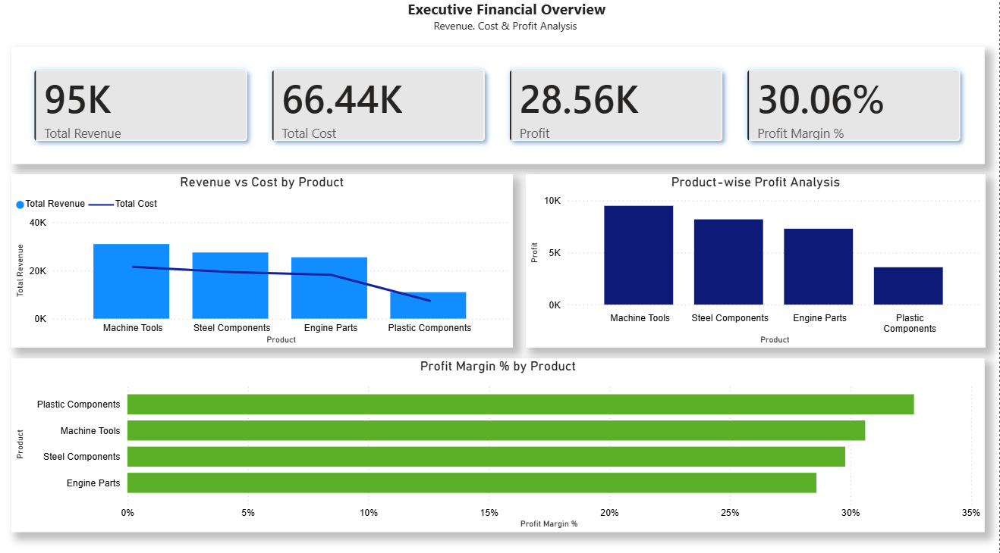
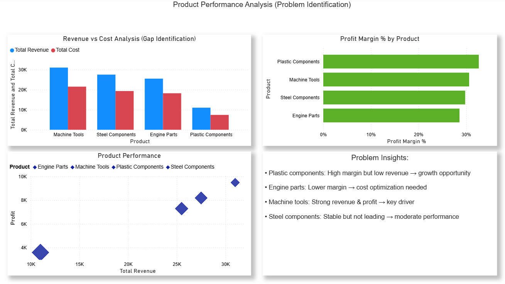
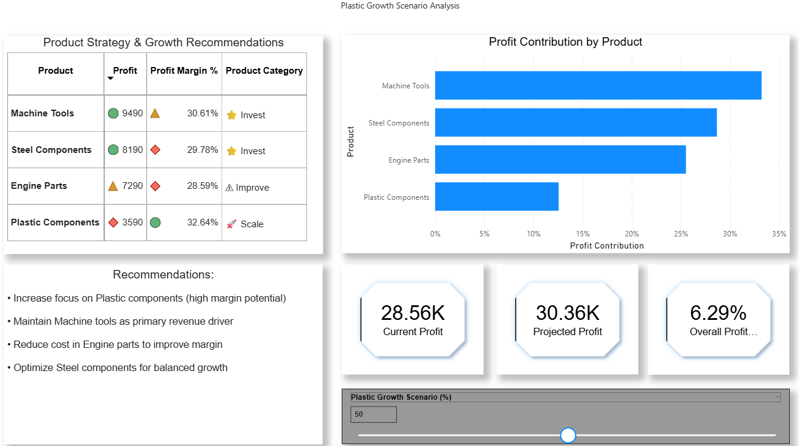

## 🚀 Scenario-Based Profit Optimization Dashboard

## Dashboard Preview

### Overview

### Analysis

### Scenario Simulation

## Key Features

- Revenue, Cost, and Profit Analysis  
- Product-wise Performance Insights  
- Profit Margin Comparison  
- Scenario-Based Profit Simulation (What-If Analysis)  
- Dynamic DAX Calculations  

## Tools Used

- Power BI  
- DAX  
- Data Modeling

## Key Insight

- Plastic components show high margin potential. Increasing their growth significantly improves overall profit, making them a key strategic focus area.
